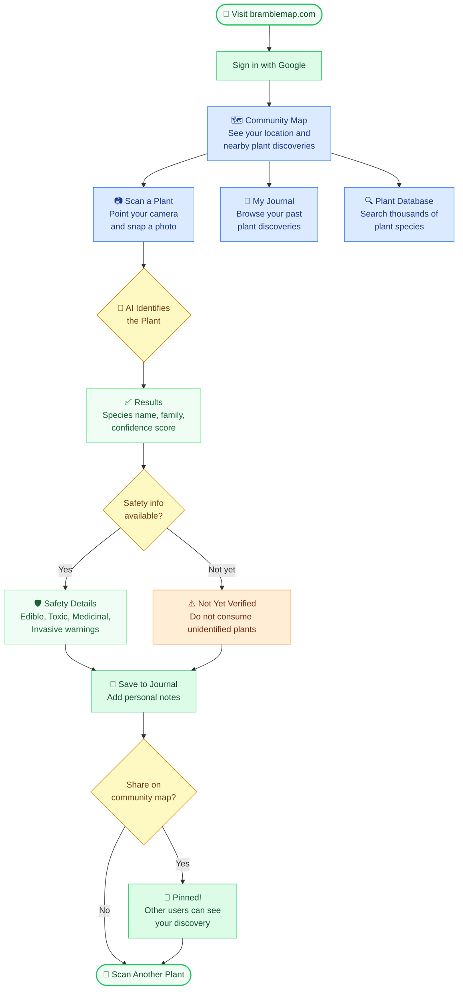

# Bramble - How It Works

> Simplified application flow for the senior project poster board.

```mermaid
flowchart TD
    Start(["🌿 Visit bramblemap.com"]) --> SignIn["Sign in with Google"]
    SignIn --> Map["🗺 Community Map\nSee your location and\nnearby plant discoveries"]

    Map --> Scan["📷 Scan a Plant\nPoint your camera\nand snap a photo"]
    Map --> Journal["📔 My Journal\nBrowse your past\nplant discoveries"]
    Map --> Plants["🔍 Plant Database\nSearch thousands of\nplant species"]

    Scan --> AI{"🤖 AI Identifies\nthe Plant"}
    AI --> Result["✅ Results\nSpecies name, family,\nconfidence score"]

    Result --> Safe{"Safety info\navailable?"}
    Safe -->|"Yes"| Badges["🛡 Safety Details\nEdible, Toxic, Medicinal,\nInvasive warnings"]
    Safe -->|"Not yet"| Warning["⚠️ Not Yet Verified\nDo not consume unidentified plants"]

    Badges --> Save["💾 Save to Journal\nAdd personal notes"]
    Warning --> Save

    Save --> Pin{"Share on\ncommunity map?"}
    Pin -->|"Yes"| MapPin["📍 Pinned!\nOther users can see\nyour discovery"]
    Pin -->|"No"| Done(["🔄 Scan Another Plant"])
    MapPin --> Done

    classDef start fill:#f0fdf4,stroke:#22c55e,color:#14532d,stroke-width:2px
    classDef page fill:#dbeafe,stroke:#3b82f6,color:#1e3a8a
    classDef action fill:#dcfce7,stroke:#22c55e,color:#14532d
    classDef decision fill:#fef9c3,stroke:#ca8a04,color:#713f12
    classDef result fill:#f0fdf4,stroke:#86efac,color:#166534
    classDef warn fill:#ffedd5,stroke:#f97316,color:#7c2d12

    class Start,Done start
    class Map,Journal,Plants,Scan page
    class SignIn,Save,MapPin action
    class AI,Safe,Pin decision
    class Result,Badges result
    class Warning warn
```
