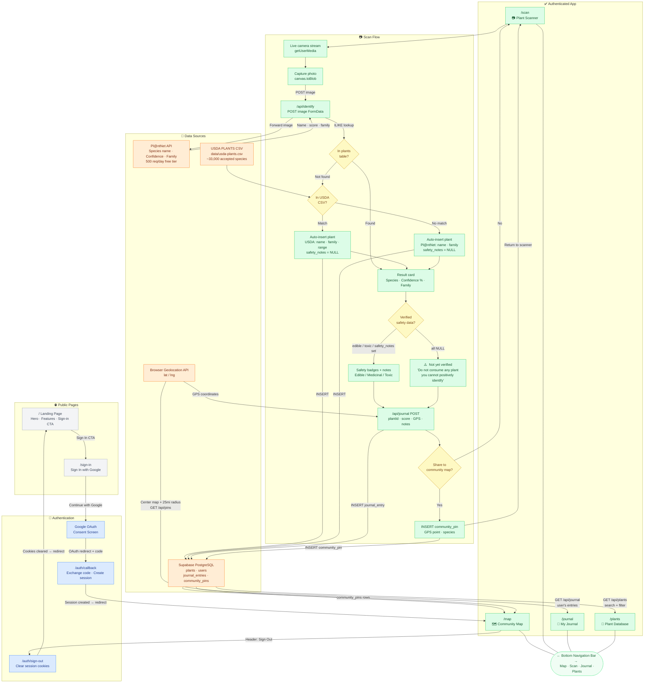

# Bramble — Application Flow Diagram

> **MAD-28** · Senior Project Presentation · Noah Madsen · May 2026
>
> This diagram covers every user flow in Bramble: authentication, bottom nav, the full
> scan-to-journal pipeline, and all data sources. Render `docs/app-flow.mmd` with
> `mmdc` for the poster-board PNG.

---

## Route Reference

| Route | Description | Auth Required |
|---|---|---|
| `/` | Landing page — hero, features, sign-in CTA | No |
| `/sign-in` | Google OAuth sign-in button | No |
| `/auth/callback` | Exchange OAuth code for session | No |
| `/auth/sign-out` | Clear session, redirect to landing | Yes |
| `/map` | Community map — default authenticated view | Yes |
| `/scan` | Live camera capture and plant identification | Yes |
| `/journal` | Personal foraging journal | Yes |
| `/plants` | Plant database search and browse | Yes |

---

## Full Application Flow



---

## Data Enrichment Pipeline

```mermaid
flowchart TD
    subgraph T1["Tier 1 · Instant — On Every Scan"]
        S[User scans plant] --> PN[Pl@ntNet identifies species]
        PN --> DBC{"In our DB?"}
        DBC -->|Yes| RF["Return full record\nwith safety data"]
        DBC -->|No| UL[Search local USDA CSV]
        UL --> AI["Auto-insert into plants table\nname · family · range · invasive\nedible / toxic / safety = NULL"]
        AI --> RP["Return partial record\n+ 'Not yet verified' warning"]
    end

    subgraph T2["Tier 2 · Daily Batch — AI Agent"]
        DA[Scheduled AI agent] --> FN["SELECT * FROM plants\nWHERE edible IS NULL"]
        FN --> RS["LLM researches each species\nagainst botanical reference sources"]
        RS --> UD["UPDATE edible · toxic · medicinal\nsafety_notes · edibility_notes\nSET verified_by = 'ai-agent'"]
    end

    subgraph T3["Tier 3 · Future — Human Review"]
        RQ[Botanist review queue] --> VF["Confirm or correct AI flags\nSET verified_by = 'human'"]
    end

    T1 -.->|"New plants with NULL safety flags"| T2
    T2 -.->|"Uncertain or high-risk species"| T3
```

---

## Data Source Matrix

| Field | Pl@ntNet API | USDA CSV | Curated 30 Plants | AI Agent (future) |
|---|:---:|:---:|:---:|:---:|
| Scientific name | ✓ | ✓ | ✓ | — |
| Common name | ✓ | ✓ | ✓ | — |
| Family | ✓ | ✓ | ✓ | — |
| Confidence score | ✓ | — | — | — |
| Related photo | ✓ | — | — | — |
| Native range | — | ✓ | ✓ | — |
| Invasive flag | — | ✓ | ✓ | — |
| Edible flag | — | — | ✓ | ✓ |
| Medicinal flag | — | — | ✓ | ✓ |
| Toxic flag | — | — | ✓ | ✓ |
| Safety notes | — | — | ✓ | ✓ |
| Edibility notes | — | — | ✓ | ✓ |
