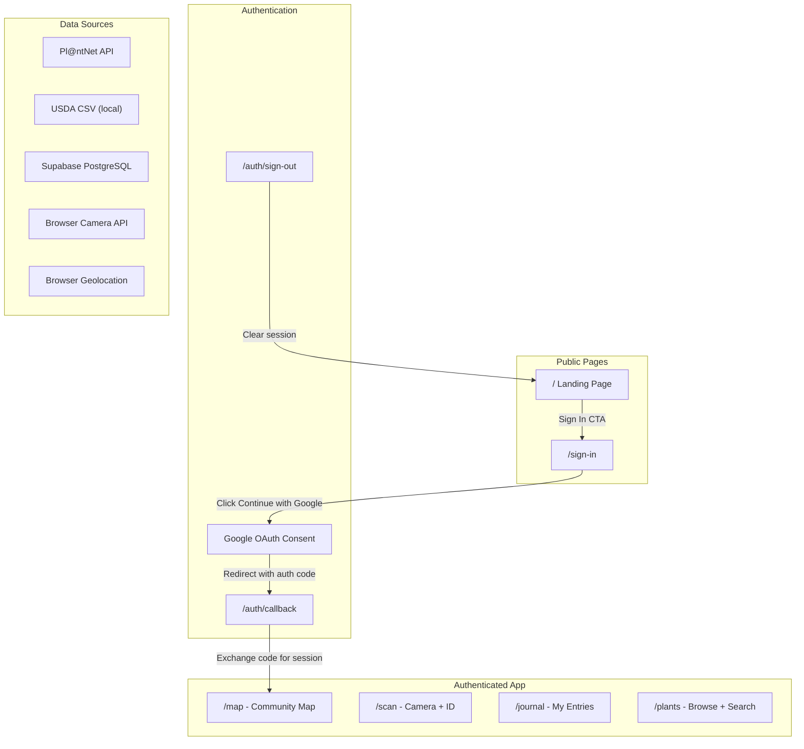

# Bramble - Application Flow Diagram

> **MAD-28: Noah, this is your task.**
>
> Use Cursor with Sonnet to expand the skeleton below into a complete application flow diagram.
> Open this file, select the mermaid block, and ask Sonnet to help you fill in the details.
>
> The diagram should show every user flow in Bramble - how pages connect, what happens at
> each step, and where data comes from. When you are done, the diagram should render cleanly
> in GitHub's markdown preview.

## Routes to include

| Route | Description | Auth Required |
|---|---|---|
| `/` | Landing page - hero, features, sign-in CTA | No |
| `/sign-in` | Google OAuth sign-in button | No |
| `/auth/callback` | OAuth callback - exchanges code for session | No |
| `/auth/sign-out` | Signs out user, redirects to landing | Yes |
| `/map` | Community map - default view after sign-in | Yes |
| `/scan` | Camera capture and plant identification | Yes |
| `/journal` | Personal foraging journal list | Yes |
| `/plants` | Plant database search and browse | Yes |

## Data sources to include

- **Pl@ntNet API** - Plant identification from photos (species name, confidence, family)
- **USDA CSV** - Local file with species data (name, family, range, invasive flag)
- **Supabase DB** - All app data (plants, users, journal entries, community pins)
- **Browser APIs** - Camera (`getUserMedia`), GPS (`geolocation`)

## Starter diagram - expand this

## Tips for Noah

1. Start by adding the bottom nav connections between Map, Scan, Journal, and Plants
2. Then expand the scan flow - show the camera capture, Pl@ntNet call, and result screen
3. Add arrows from data sources to the pages that use them
4. Show how a scan result flows into both a journal entry AND a community map pin
5. Reference `docs/scan-flow.md` for the detailed scan sequence diagram if you need help
