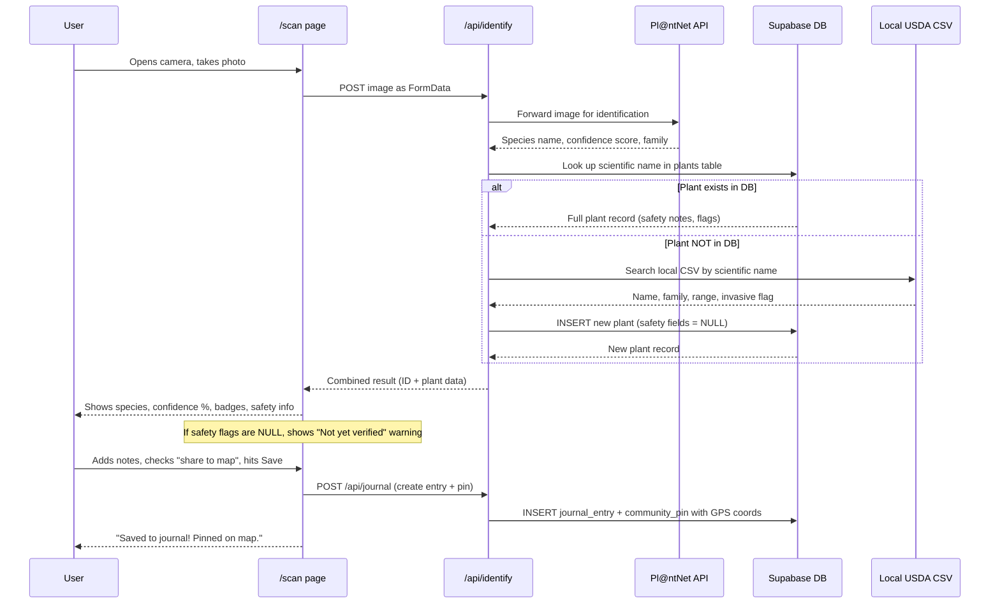

# Bramble — Feature Architecture
**Senior Shadow Program · May 2026 · Noah**

---

## Core Premise

**AI photo plant identification is the engine of this app.** Every other feature exists to support, enrich, or extend what happens when a user points their camera at a plant and gets an answer. Without it, the journal has no trigger, the Field Guide has no source, the map has no pins, and the quiz has nothing to test. The photo ID feature is not one feature among many — it is the one feature everything else is built around.

---

## Technology Stack

### Frontend
| Layer | Technology | Why |
|---|---|---|
| **Framework** | Next.js (App Router) on Vercel | React-based, file-system routing, serverless API routes, first-class Vercel deployment |
| **Styling** | Tailwind CSS | Utility-first, mobile-friendly by default, fast to build with |
| **UI components** | shadcn/ui | Pre-built accessible components built on Tailwind; copy-paste into the project, no vendor lock-in |
| **Maps** | react-leaflet + Leaflet.markercluster | react-leaflet is the React wrapper for Leaflet.js (already chosen); markercluster handles community pin grouping at the map level |
| **Server state / caching** | TanStack Query | Manages API calls, caching, and loading states for plant ID results, map pins, journal entries |
| **Forms & validation** | React Hook Form + Zod | Lightweight form management with TypeScript schema validation |
| **Camera** | `navigator.mediaDevices.getUserMedia()` + `<input type="file" accept="image/*" capture="environment">` | `getUserMedia` streams the rear camera live in-browser for the scan viewfinder. The `<input capture>` fallback opens the native camera app on mobile if `getUserMedia` is unavailable. Together these cover all modern browsers and iOS/Android. |
| **Geolocation** | `navigator.geolocation.getCurrentPosition()` | Returns the device's current latitude/longitude. Used to center the map on load, attach coordinates to journal entries, and calculate the 25-mile radius for plant/pin queries. Browser prompts the user for permission on first use. |

### Backend
| Layer | Technology | Why |
|---|---|---|
| **API** | Next.js API Routes (serverless) | Co-located with the frontend, auto-deployed as Vercel serverless functions |
| **Database** | Supabase (PostgreSQL + PostGIS) | Postgres gives relational data modeling; PostGIS extension handles the 25-mile radius geospatial queries natively. Supabase free tier is generous for v1. |
| **ORM** | Drizzle ORM | TypeScript-native, lightweight, generates type-safe queries directly from your schema. Less abstraction than Prisma — closer to writing SQL, which helps with learning. |
| **Auth** | Supabase Auth | Comes built into Supabase. Handles session management, JWTs, and OAuth flows out of the box. |
| **OAuth Provider** | Google only (v1) | Covers the vast majority of users; simpler to configure and maintain than multi-provider. |
| **File storage** | Supabase Storage | Stores user-uploaded photos attached to journal entries. Seeded species stock images also stored here. |

### Plant Identification
| Role | Technology | Details |
|---|---|---|
| **ID engine** | Pl@ntNet API (free tier) | Receives a photo, returns a ranked species match with confidence score. Free tier: 500 identifications/day — sufficient for a capstone demo. If Bramble scales, Pro plan is €1,000/year. |
| **Plant profile data** | USDA PLANTS database | Bulk CSV stored locally at `data/usda-plants.csv`. Used for initial database seeding and on-the-fly lookups when a scan identifies a species not yet in our DB. Provides scientific/common names, family, native range, and invasive/noxious flags. Does NOT include edibility or safety data - those come from curated seeds or the AI enrichment pipeline. |
| **Species name mapping** | Custom matching layer | Pl@ntNet returns a scientific species name. That name is matched against Supabase records first. If no match, the local USDA CSV is checked and a new record is auto-inserted. This ensures every scan produces a plant record in the database. |
| **Seed images** | USDA PLANTS / PlantNet-300K | One stock image per species stored in Supabase Storage. Used on plant cards and as the canonical map pin image for that species. |

### Data Flow: Camera Scan



### Data Source Matrix

| Field | Pl@ntNet API | USDA CSV | Curated Seed (30 plants) | Future: AI Agent |
|---|---|---|---|---|
| Scientific name | Yes | Yes | Yes | - |
| Common name | Yes | Yes | Yes | - |
| Family | Yes | Yes | Yes | - |
| Confidence score | Yes | - | - | - |
| Related photo | Yes | - | - | - |
| Native range | - | Yes | Yes | - |
| Invasive flag | - | Yes | Yes | - |
| Edible flag | - | - | Yes (hand-verified) | Yes (batch) |
| Medicinal flag | - | - | Yes (hand-verified) | Yes (batch) |
| Toxic flag | - | - | Yes (hand-verified) | Yes (batch) |
| Safety notes | - | - | Yes (hand-verified) | Yes (batch) |
| Edibility notes | - | - | Yes (hand-verified) | Yes (batch) |

### Data Enrichment Pipeline

Plant safety data flows through three tiers, from instant to eventually-verified:

```mermaid
flowchart TD
    subgraph tier1 [Tier 1: Instant - On Scan]
        Scan[User scans plant] --> PlantNet[Pl@ntNet identifies species]
        PlantNet --> DBCheck{In our DB?}
        DBCheck -->|Yes| ReturnFull[Return full record]
        DBCheck -->|No| USDALookup[Search local USDA CSV]
        USDALookup --> AutoInsert["INSERT into plants table\n(name, family, range, invasive)\nEdible/toxic/safety = NULL"]
        AutoInsert --> ReturnPartial["Return partial record\n+ 'Not yet verified' warning"]
    end

    subgraph tier2 [Tier 2: Daily - AI Agent Batch]
        DailyAgent[Scheduled AI agent] --> FindNulls["SELECT * FROM plants\nWHERE edible IS NULL"]
        FindNulls --> Research["LLM researches each species\nagainst botanical sources"]
        Research --> UpdateDB["UPDATE plants SET edible, toxic,\nmedicinal, safety_notes\nSET verified_by = 'ai-agent'"]
    end

    subgraph tier3 [Tier 3: Future - Human Review]
        ReviewQueue[Human botanist review queue] --> VerifyFlags["Confirm or correct AI flags\nSET verified_by = 'human'"]
    end

    tier1 -.->|"Plants with NULL safety flags"| tier2
    tier2 -.->|"Uncertain or high-risk species"| tier3
```

**Tier 1 (instant):** Every scan returns a result. If the plant is new, we auto-insert from USDA data with NULL safety flags and show a "not yet verified" warning.

**Tier 2 (daily batch):** A scheduled AI agent queries all plants with NULL safety flags, researches them against reliable botanical sources, and populates edible/medicinal/toxic flags and safety notes. Records are marked with `verified_by = 'ai-agent'` and `verified_at` timestamp.

**Tier 3 (future):** For species the AI flags as uncertain or high-risk (e.g., toxic look-alikes), a human botanist review queue allows expert verification. Records upgraded to `verified_by = 'human'`.

> **Schema note:** Future migration should add `verified_at TIMESTAMPTZ` and `verified_by VARCHAR` columns to the `plants` table to track data provenance.

### Map Pin Image Policy
- **Map pins** always display the **seeded stock image** for the species (consistent, no per-user storage cost)
- **Journal entries** can have a **user-uploaded photo** attached (personal record, visible only to the user in v1)
- User photos are stored in Supabase Storage; the seeded stock image lives alongside them in a separate bucket

---

## Open Design Decisions

| Decision | Options | Consideration |
|---|---|---|
| **Map pin image source** | ~~A) Seeded DB image &nbsp; B) User's scan photo~~ | **Resolved:** Map pins always use the seeded stock image (consistent, no per-user storage cost). Users can attach their own photo to the journal entry separately. |
| **Map library** | ~~Leaflet.js vs. Google Maps~~ | **Resolved:** Leaflet.js via react-leaflet. Free, open source, no API key required. Google Maps deferred to v2 if needed. |

---

## Must-Have
*Required for launch. The app is not shippable without these.*

| # | Feature | What it does |
|---|---|---|
| 1 | **User entity** | Handles account creation, login, logout, and profile so every user's journal entries, shared finds, and map pins are tied to them personally. |
| 2 | **Plant database** | A structured dataset of forageable plants (images, identifiable features, edibility/safety notes, geolocation) that users can browse and search at any time — returnable as a row list or directly on the map. Default filter is all plants within 25 miles; radius is user-adjustable. Built to be trainable by an AI model later. |
| 3 | **Community map** | The default app view — opens to a map centered on the user's location with their pin shown. All community entries within the user's radius are displayed and clustered accordingly. Users can also switch to map view while browsing the plant database to see results plotted geographically. |
| 4 | **AI plant identification** | User points their camera at a plant and takes a photo — the app sends it to the Pl@ntNet API, which returns a species identification and confidence score. The species name is matched against the USDA-seeded database to display safety info, best uses, and key features. The result automatically pre-fills a journal entry with the plant name, date, and location. |
| 5 | **Personal journal** | Auto-created after each AI identification, pre-filled with plant name, location, and date. Users can add personal notes to each entry — notes are private and never shared at launch. |
| 6 | **Community Field Guide** | A crowd-built reference that only grows when a user finds a plant not already in Bramble's seeded database — novel finds fill the gaps that USDA and PlantNet data don't cover. |
| 7 | **Mobile-friendly UI** | Ensures the app works cleanly on a phone screen, since users will be in the field when they use it. |
| 8 | **Deploy to Vercel** | Makes the app publicly accessible at a real URL (bramblemap.com) so it can be demoed to anyone. |
| 9 | **Invasive species flag** | Marks invasive plants in the database and on the map with a clear badge, and tells the user it's safe (and encouraged) to remove them. USDA database includes invasive/noxious flags; PlantNet-300K for images. |
| 10 | **Plant database search + filter** | Lets users search and filter the plant database by category (edible, medicinal, toxic, invasive) and toggle results between row list view and map view. |
| 11 | **Plant quiz** | Pulls plants from the user's historical interactions with the app and quizzes them to improve identification skills. |

---

## Nice-to-Have
*Valuable features that improve the app but won't block launch.*

| # | Feature | What it does |
|---|---|---|
| 1 | **Seasonal filter on map (automatic)** | Lets users filter map pins by season so they only see what's actually findable right now. |
| 2 | **Advanced plant database filter** | Adds compound filtering (combine multiple categories at once) and saved filter presets for power users. |
| 3 | **Photo upload on journal entries** | Lets users attach a photo to each log entry so they have a visual record of what they actually found. |
| 4 | **Share notes on journal entries** | Lets users optionally share their personal notes publicly alongside the plant ID, location, and date when a find is posted to the Field Guide and map. |
| 5 | **Safety badge on plant cards** | Displays a clear visual indicator (safe / caution / toxic) on each plant card so edibility is obvious at a glance. |

---

## Later
*Post-launch ideas for a v2 or beyond — too ambitious for 25 hours.*

| # | Feature | What it does |
|---|---|---|
| 1 | **Train proprietary AI model** | Replace the third-party Plant.id / iNaturalist API with a custom-trained model built on the community's own logged plant data. |
| 2 | **In-season notifications** | Sends a push notification when a plant the user has logged before comes back into season in their area. |
| 3 | **Social forager profiles** | Lets users follow other foragers, see their public logs, and comment on community map pins. |
| 4 | **Mushroom / fungi section** | Expands the plant browser to cover foraging fungi with spore prints, cap shapes, and look-alike warnings. |
| 5 | **Offline mode (PWA)** | Caches the plant browser and the user's field guide locally so the app works without cell service in the woods. |
| 6 | **Weather + conditions integration** | Pulls local weather data to tell users whether today is a good foraging day based on recent rain and temperature. |
| 7 | **Foraging certification track** | Adds a structured quiz path that takes a beginner through progressively harder plant identification challenges. |
| 8 | **Badges** | Gamified version of app, gives badges based off of a certain number of logs to journal. |

---

*Feature list derived from brainstorm session conducted May 14–15, 2026.*
