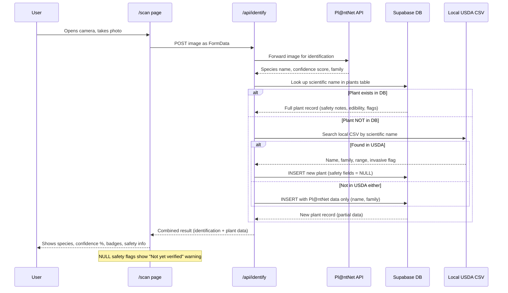
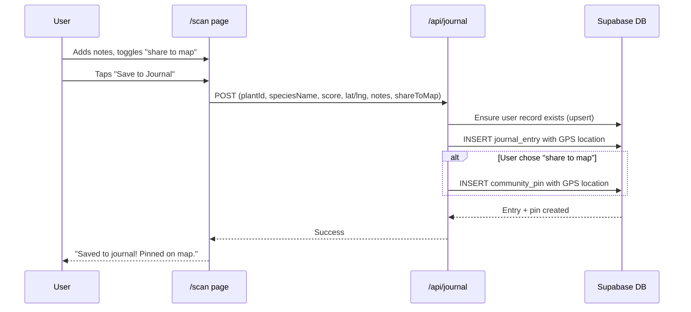

# Bramble - Plant Scan Flow

This diagram shows the complete flow when a user scans a plant, from camera capture through identification, database lookup, and journal/map storage.

## Scan Identification Flow



## Save to Journal and Map



## Data Enrichment Pipeline

```mermaid
flowchart TD
    subgraph tier1 [Tier 1: Instant - On Every Scan]
        Scan[User scans plant] --> PlantNet[Pl@ntNet identifies species]
        PlantNet --> DBCheck{In our DB?}
        DBCheck -->|Yes| ReturnFull[Return full record with safety data]
        DBCheck -->|No| USDALookup[Search local USDA CSV]
        USDALookup --> AutoInsert["Auto-insert into DB\nname, family, range, invasive\nEdible/toxic/safety = NULL"]
        AutoInsert --> ReturnPartial["Return partial record\n+ 'Not yet verified' warning"]
    end

    subgraph tier2 [Tier 2: Daily Batch - AI Agent]
        DailyAgent[Scheduled AI agent] --> FindNulls["Query plants WHERE edible IS NULL"]
        FindNulls --> Research["LLM researches each species\nagainst botanical reference sources"]
        Research --> UpdateDB["UPDATE edible, toxic, medicinal,\nsafety_notes, edibility_notes\nSET verified_by = 'ai-agent'"]
    end

    subgraph tier3 [Tier 3: Future - Human Review]
        ReviewQueue[Botanist review queue] --> VerifyFlags["Confirm or correct AI flags\nSET verified_by = 'human'"]
    end

    tier1 -.->|"New plants with NULL safety flags"| tier2
    tier2 -.->|"Uncertain or high-risk species"| tier3
```

## Data Source Matrix

| Field | Pl@ntNet API | USDA CSV | Curated Seed | Future: AI Agent |
|---|---|---|---|---|
| Scientific name | Yes | Yes | Yes | - |
| Common name | Yes | Yes | Yes | - |
| Family | Yes | Yes | Yes | - |
| Confidence score | Yes | - | - | - |
| Related photo | Yes | - | - | - |
| Native range | - | Yes | Yes | - |
| Invasive flag | - | Yes | Yes | - |
| Edible flag | - | - | Yes | Yes |
| Medicinal flag | - | - | Yes | Yes |
| Toxic flag | - | - | Yes | Yes |
| Safety notes | - | - | Yes | Yes |
| Edibility notes | - | - | Yes | Yes |
